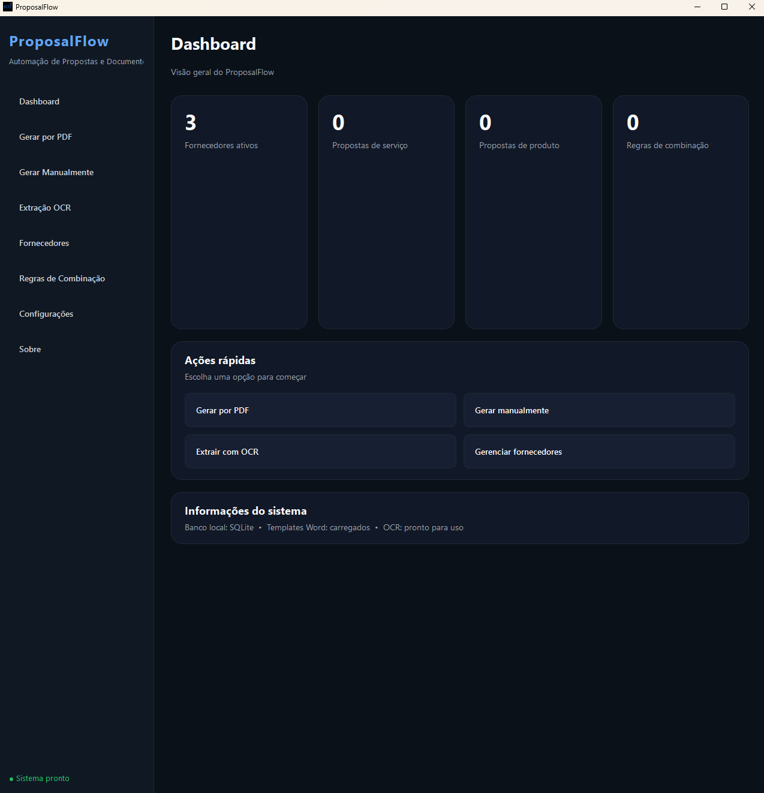
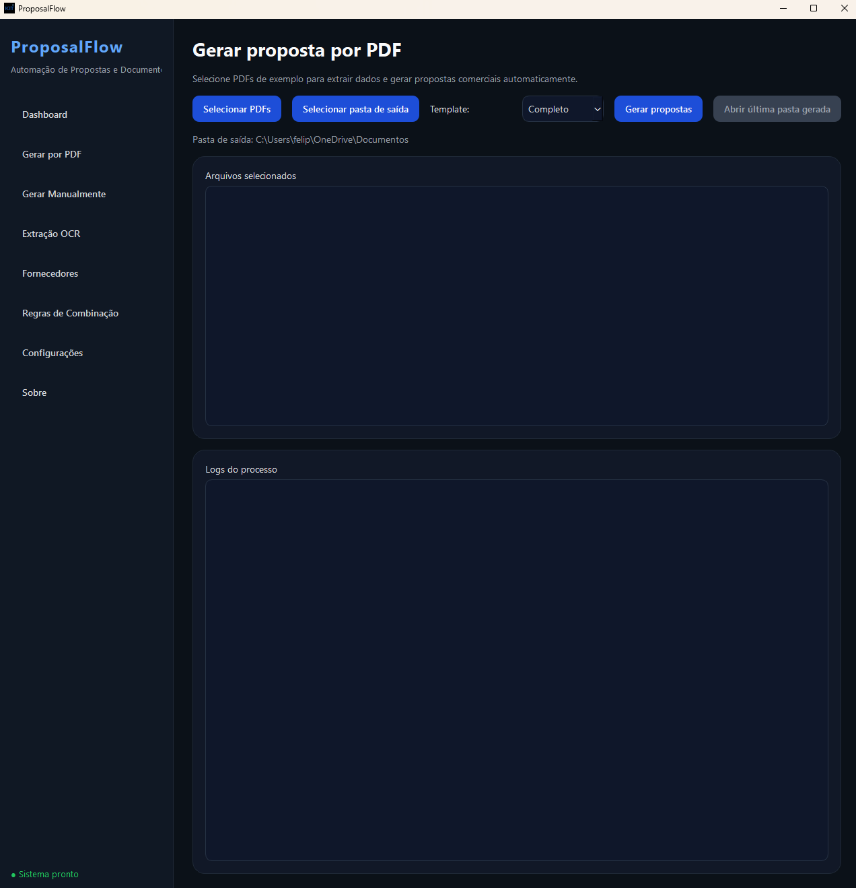
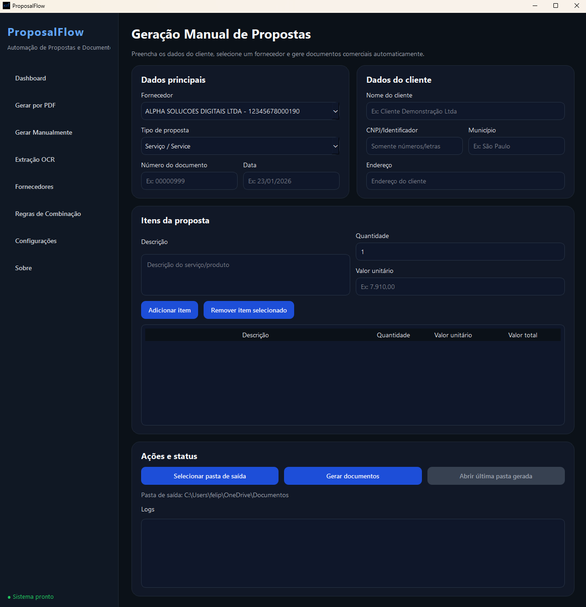
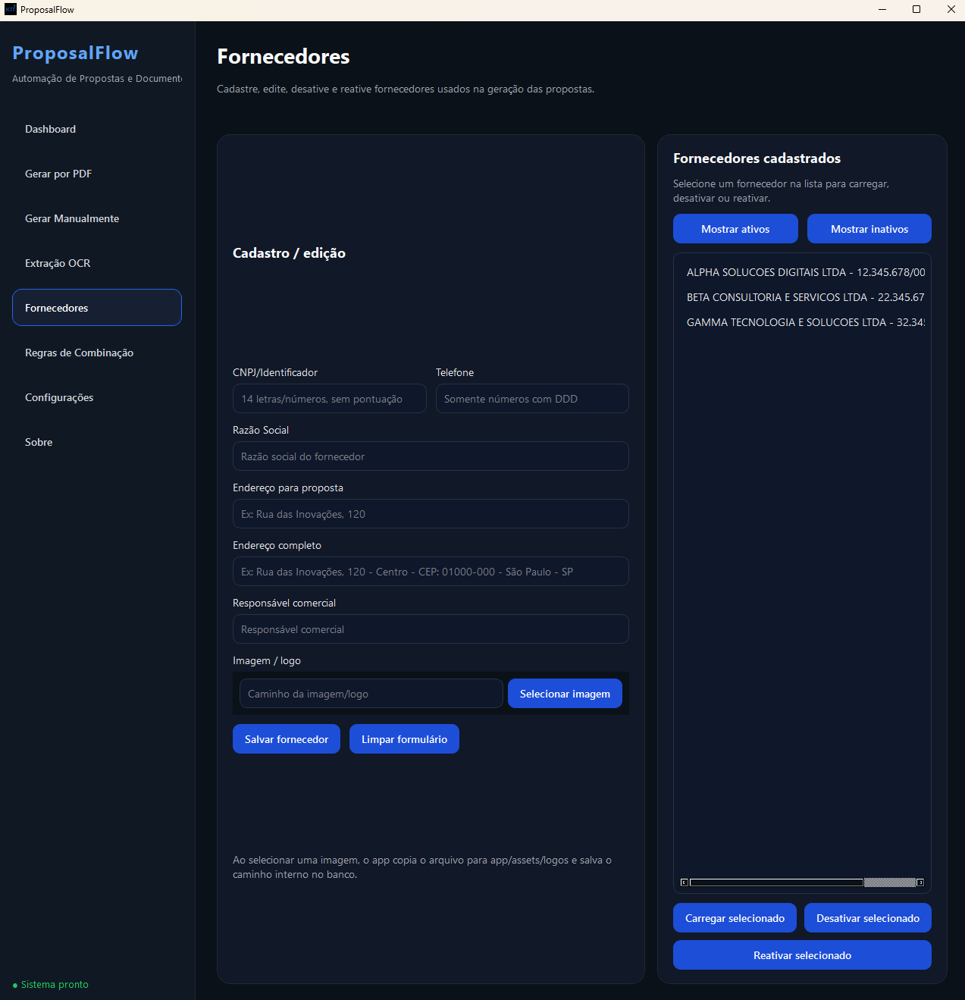
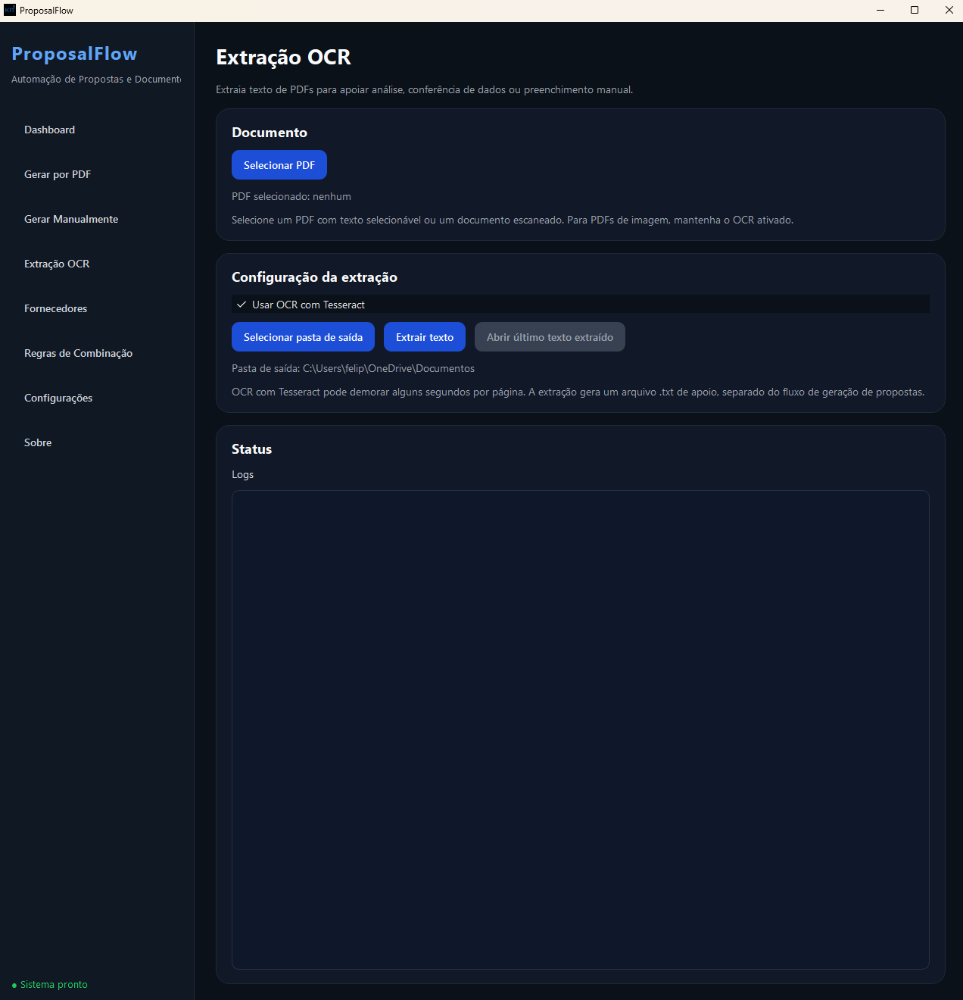
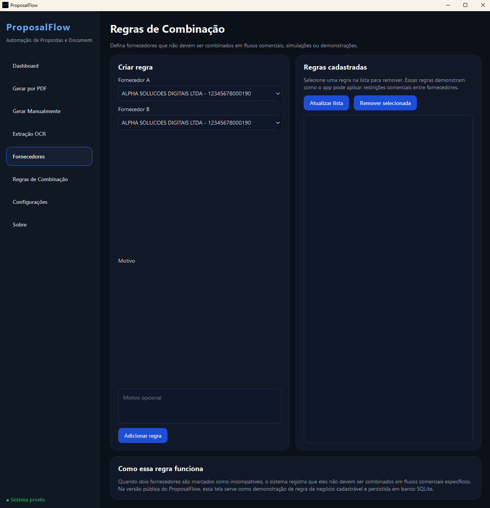
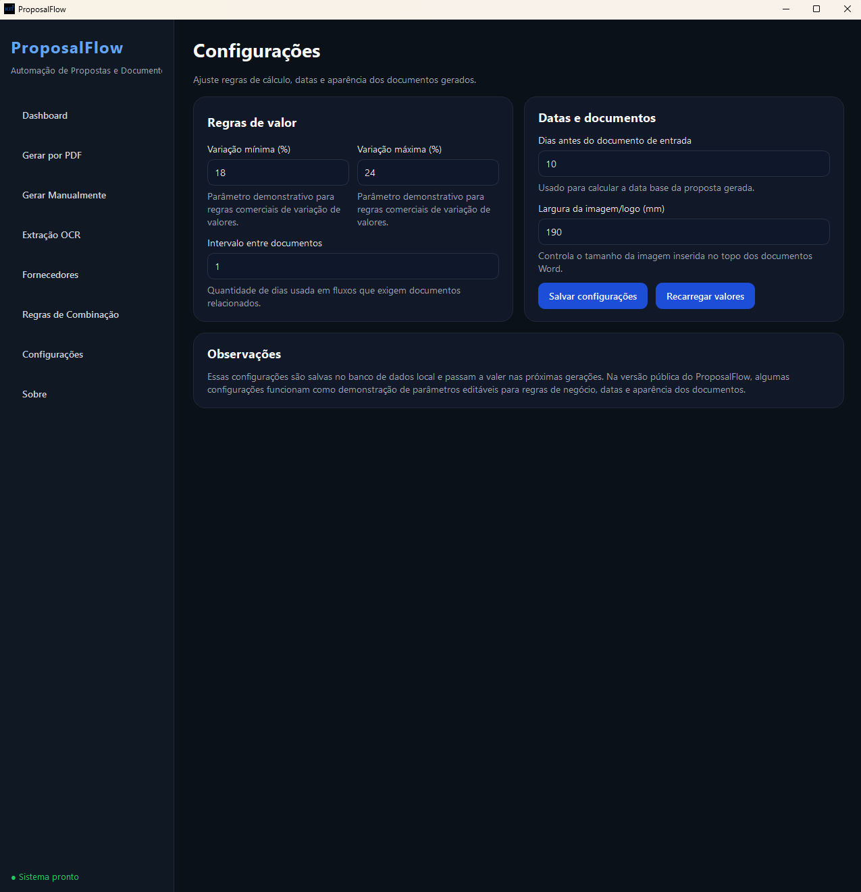
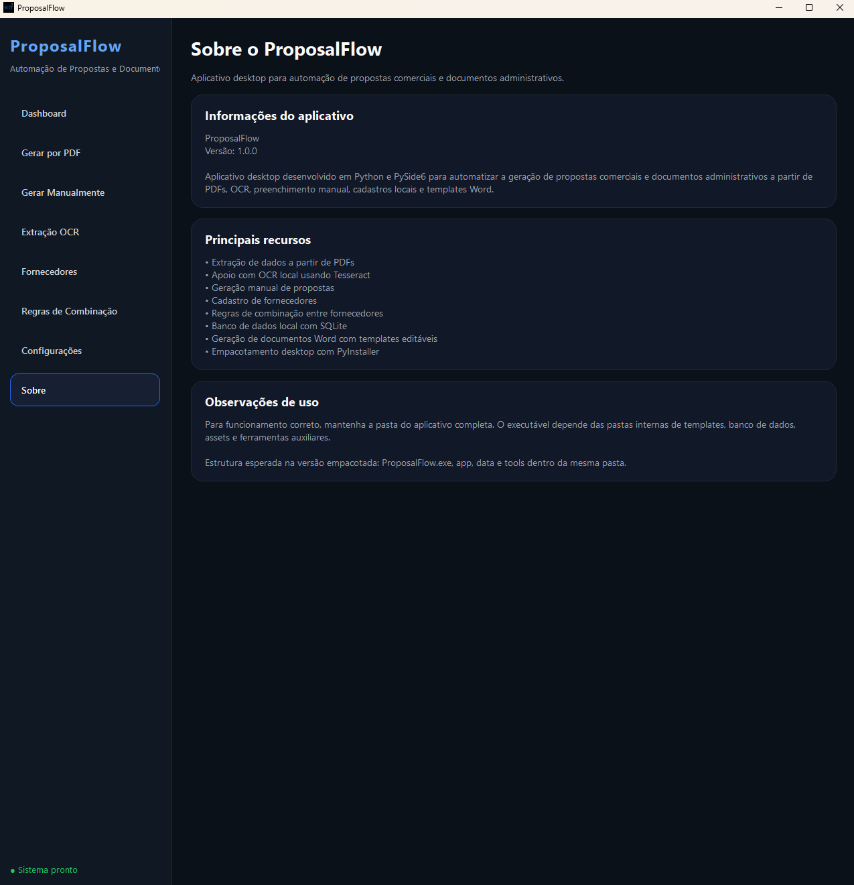

# ProposalFlow

**ProposalFlow** is a desktop application built with Python and PySide6 to automate the generation of commercial proposals and administrative documents from PDF extraction, OCR support, manual form input, local database records and editable Word templates.

**ProposalFlow** é um aplicativo desktop desenvolvido em Python e PySide6 para automatizar a geração de propostas comerciais e documentos administrativos a partir de leitura de PDFs, OCR, preenchimento manual, banco de dados local e templates Word editáveis.

---

## Screenshots / Capturas de tela

### Dashboard



### PDF generation / Geração por PDF



### Manual generation / Geração manual



### Suppliers / Fornecedores



### OCR extraction / Extração OCR



### Business rules / Regras de combinação



### Settings / Configurações



### About / Sobre



---

## Overview / Visão geral

ProposalFlow was designed as a portfolio project to demonstrate a complete desktop automation workflow, including:

O ProposalFlow foi desenvolvido como projeto de portfólio para demonstrar um fluxo completo de automação desktop, incluindo:

- PDF text extraction
- OCR support with Tesseract
- Manual document generation
- Supplier registration
- Business rules persisted in SQLite
- Word document generation with templates
- Dark themed PySide6 interface
- PyInstaller packaging

---

## Features / Funcionalidades

### PDF-based generation / Geração por PDF

The app reads example PDFs, extracts structured information and generates commercial documents automatically.

O app lê PDFs de exemplo, extrai informações estruturadas e gera documentos comerciais automaticamente.

Generated files / Arquivos gerados:

- Complete Commercial Proposal / Proposta Comercial Completa
- Simple Commercial Proposal / Proposta Comercial Simples
- Technical Summary / Resumo Técnico
- Commercial Declaration / Declaração Comercial

### Manual generation / Geração manual

The user can manually fill client, supplier and item data to generate the same set of documents.

O usuário pode preencher manualmente os dados do cliente, fornecedor e itens para gerar o mesmo conjunto de documentos.

### OCR extraction / Extração OCR

ProposalFlow includes OCR support using Tesseract to extract text from scanned PDFs or image-based documents.

O ProposalFlow inclui suporte a OCR com Tesseract para extrair texto de PDFs escaneados ou documentos baseados em imagem.

### Supplier management / Cadastro de fornecedores

The app includes a local supplier database with create, update, deactivate and reactivate operations.

O app inclui um banco local de fornecedores, com cadastro, edição, desativação e reativação.

### Business rules / Regras de negócio

Combination rules can be registered between suppliers as an example of configurable business restrictions.

Regras de combinação podem ser cadastradas entre fornecedores como exemplo de restrições comerciais configuráveis.

### Settings / Configurações

The settings page demonstrates configurable parameters such as value variation, document date rules and image size in generated Word files.

A tela de configurações demonstra parâmetros editáveis como variação de valores, regras de datas e tamanho de imagem nos documentos Word gerados.

---

## Technologies / Tecnologias

- Python
- PySide6
- SQLite
- PyMuPDF
- pytesseract
- Tesseract OCR
- python-docx / docxtpl
- PyInstaller

---

## Project structure / Estrutura do projeto

```text
proposalflow-app/
├── app/
│   ├── main.py
│   ├── ui/
│   ├── services/
│   ├── repositories/
│   ├── utils/
│   ├── templates/
│   └── assets/
├── data/
│   └── app.db
├── examples/
│   └── sample PDFs
├── screenshots/
│   └── app screenshots
├── tools/
│   └── tesseract/
├── requirements.txt
├── README.md
└── .gitignore